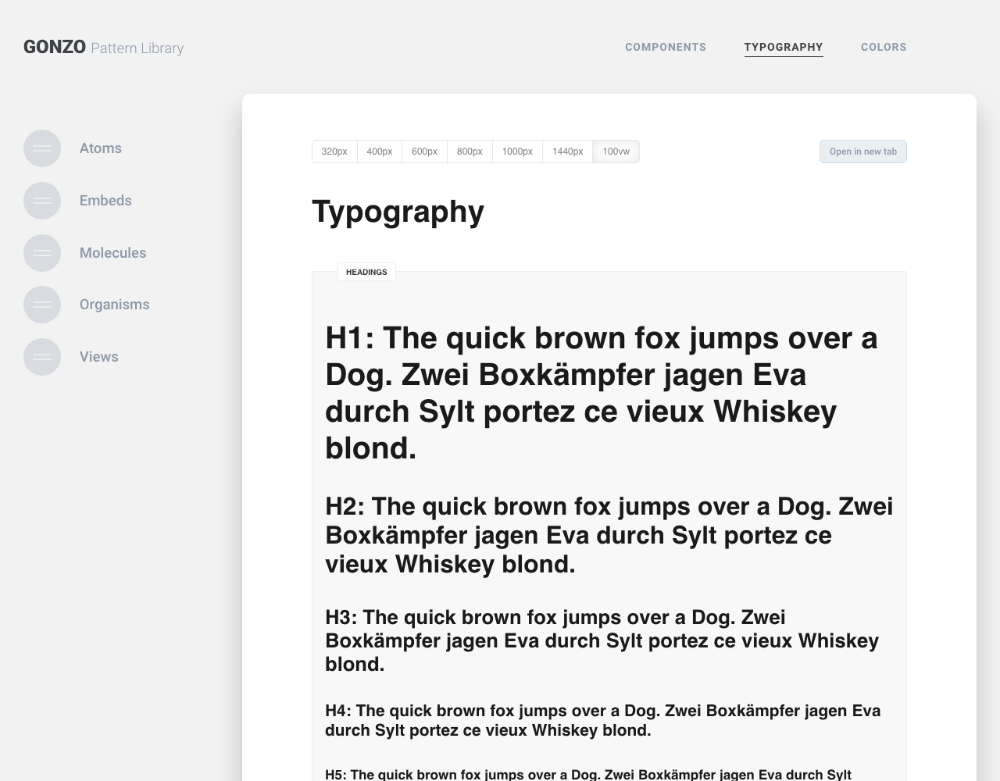

# Gonzo — Pattern Library

Gonzo is the Pattern Library with less effort. You've just created config files to bring your components in the library. 
It's quite simple. You need no third party tool to have a pattern library. Just write your code as usual but start not
with dummy hard written content in your templates. You also need entries in the backend (just some images) to fill your components.
Each component have an config.php file and here is all the magic. It's a huge advantage to use gonzo. 

The developer can create components decoupled from templates or whole pages. Focus on the component and build all variants 
for your specific component. When you are done set the status to **review** or something else and give it back to the designer to
get an approval. The whole team can see the component status and it's clear for all what's done and what's on development. 

A second huge benefit for the team is that you can see all you components on one place. What's not in the library does not exist.
It's really clear someone can check which buttons are currently on the project. 

Third benefit is you can discuss about specific components with the client without lose the focus. 

It's a living library and if your project grows your library will grow too!

---
**Table of contents**

* [Requirements](#requirements)
* [Installation](#installation)
* [Screenshots](#screenshots)
* [Example](#example)
* [Roadmap](#roadmap)
---


## Requirements
This plugin requires Craft CMS 3.0.0 or later.

## Installation
### Install via composer

```bash
composer require haariga/craft-gonzo
```

### Install via Admin Control Panel
Go to the Plugin Store and search for: `Gonzo` and install it. 


## Screenshots

### Components

#### Headline


#### Contact Form


#### Image Grid


### Typography

#### Headings



#### Glyphs


### Colors

#### Branding Colors


#### Grayscales


## Example
### Headline Component

Here is a real world example. It's a simple headlone component. In this case, it's an `atom`.
Overall we have four files. `_template.html` is our Template file with all the template logic inside.
`config.php` is the core file to render the module in the pattern lib. Here is the dummy content to fill
the component. Here are also the different variants to define. In this case **H1**, **H2** etc. Third file is the `_style.scss` file 
where we can style our component. Last file ist the `_script.js` file when the component needs some Javascript code.  


#### _template.html

```twig
{# @var craft \craft\web\twig\variables\CraftVariable #}
{# @var entry \craft\elements\Entry #}
{#
  a-headline
  ------------------------------------------------------------
#}

{# -- Set Defaults -- #}


{# -- Merge Default with Options -- #}


{# -- Modul -- #}

  <{{ opt.size }} class="{{ opt.cn }}
              
                {{ modifier | length ? '  ' ~ opt.cn ~ '--' ~ modifier }}
              
              
                {{ customClass | length ? '  ' ~ customClass }}
                {{ opt.js ? opt.cn|replace({ 'a-' : 'js-' }) : '' }}"
              
                {{ 'data-' ~ key ~ '=' ~ value }}
              >
    {{ opt.text }}
  </{{ opt.size }}>


```

#### config.php

```php
<?php
// Describe your component
$componentMeta = [
    'title' => 'Headline',
    'status' => 'done',
    'visible' => true,
    'type' => 'atom',
    'path' => '_atoms/headline/',
    'description' => 'This area the global / default Headline styles.'
];

// That's your default Variant. When you need just a single
// Variant you can describe it all here.
$defaultVariant = [
    'title' => 'Headline H1',
    'status' => '',
    'description' => 'This is a H1 Headline.',
    'cn' => 'a-headline',
    'modifiers' => [],
    'customClasses' => [],
    'data' => [],
    'js' => null,
    'waypoint' => null,
    'waypointAni' => null,
    'text' => 'The quick brown fox jumps over the lazy dog.',
    'size' => 'h1'
];

// When you need more as one variant this part is your friend.
// You can add endless variants.
return [
    'meta' => array_merge($componentMeta, []),
    'variants' => [
        'headline' => array_merge($defaultVariant, []),
        'headline--h2' => array_merge($defaultVariant, [
            'title' => 'Headline H2',
            'description' => 'This is a H2 Headline.',
            'size' => 'h2',
        ]),
        'headline--h3' => array_merge($defaultVariant, [
            'title' => 'Headline H3',
            'description' => 'This is a H3 Headline.',
            'size' => 'h3',
        ]),
        'headline--h4' => array_merge($defaultVariant, [
            'title' => 'Headline H4',
            'description' => 'This is a H4 Headline.',
            'size' => 'h4',
        ]),
        'headline--h5' => array_merge($defaultVariant, [
            'title' => 'Headline H5',
            'description' => 'This is a H5 Headline.',
            'size' => 'h5',
        ]),
        'headline--h6' => array_merge($defaultVariant, [
            'title' => 'Headline H6',
            'description' => 'This is a H6 Headline.',
            'size' => 'h6',
        ]),
    ]
];

```


#### _style.scss

```scss

/*
 |--------------------------------------------------------------------------
 |  a-headline
 |--------------------------------------------------------------------------
 */

// Modul
.a-headline {
  $root: &;
  width: 100%;

  + .a-subline {
    margin-top: s(2);
  }
}

// Modul Modifiers Example
.a-headline--modifier {
  .a-headline__block {
    // Styles here
  }
}
```

#### _script.js

```js
/**
 * headline
 */

const headline = {
    cfg:  {
        name: `headline`
    },

    log(msg) {
        console.log(msg)
    },

    init() {
        this.log(`Init: ${this.cfg.name}`)
    }
}

export default headline


```


## Roadmap
Some things to do, and ideas for potential features:

* Release it

Brought to you by [Martin Herweg](https://martinherweg.de)
